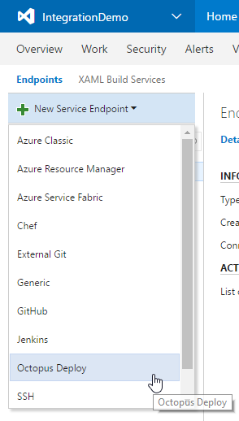
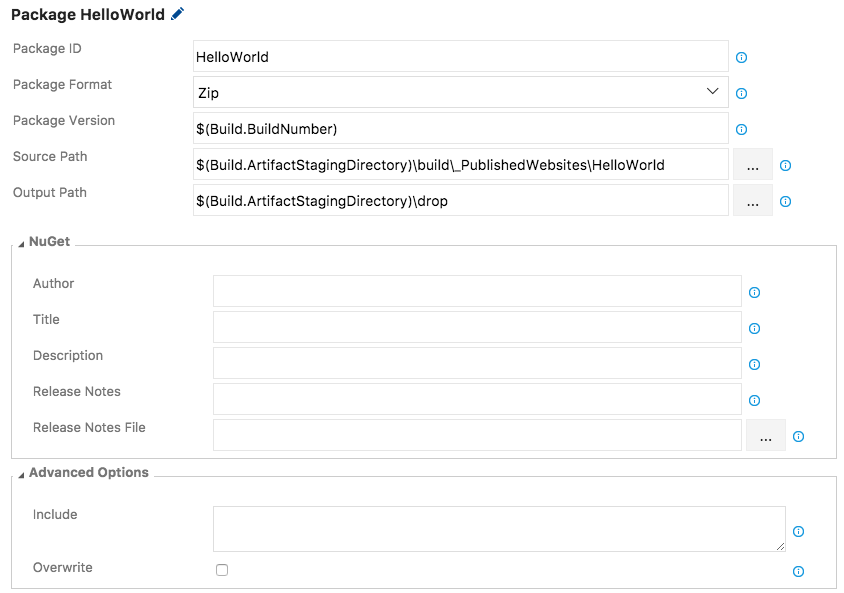
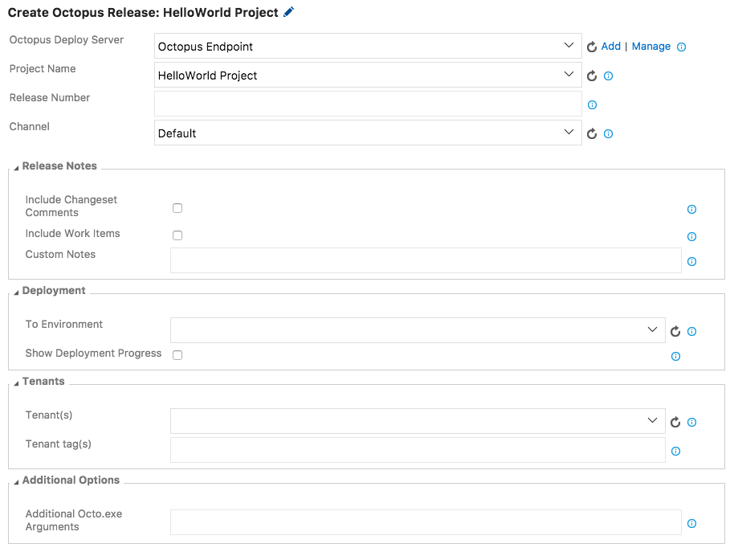

This extension provides Build and Release tasks to integrate with [Octopus Deploy](http://octopus.com).

Note: This extension is incompatible with on-premises TFS 2015. See <a href="https://octopus.com/docs/api-and-integration/team-foundation-server-tfs">the Octopus Documentation for an alternative extension</a>

## Create an Octopus Deploy Connected Service
Before adding any Build or Release tasks to your process, configure an "Octopus Deploy" connected service in the administration section for your project.

You'll need an API Key for a user that has sufficient permissions for the tasks you want to perform in your build and release process.
For example, if your build needs to create a Release for Project A, the user who owns that API key will need ReleaseCreate role either unscoped or scoped to Project A.

## Tasks

This extension adds the following tasks:

- [Package Application](#package-application)
- [Push Packages to Octopus](#push-packages-to-octopus)
- [Create Octopus Release](#create-octopus-release)
- [Deploy Octopus Release](#deploy-octopus-release)
- [Promote Octopus Release](#promote-octopus-release)

###  Package Application

*Note: You can still use [OctoPack](http://docs.octopusdeploy.com/display/OD/Using+OctoPack) as part of your MSBuild task to package and push Nuget packages to Octopus.*

 
 Options include:
 * **Package ID**: The ID of the package. e.g. MyCompany.App
 * **Package Format**: NuPkg or Zip
 * **Package Version**: The version of the package; must be a valid [SemVer](http://semver.org/) version; defaults to a timestamp-based version.
 * **Source Path**: The folder containing the files and folders to package. Defaults to working directory.
 * **Output Path**: The directory into which the generated package will be written. Defaults to working directory.
 * **NuGet Section**: This section lets you include additional details for the NuGet Package Metadata.
 * **Advanced Options Section**: Additional files to include in the package, and whether to overwrite any existing file of the same name.

###  Push Packages to Octopus

 
 Options include:
 * **Octopus Deploy Server**: Dropdown for selecting your Octopus Server (click Add or Manage to [create](#create-connected-service)).
 * **Package**: Package file to push. To push multiple packages, enter on multiple lines.
 * **Replace Existing**: If the package already exists in the repository, the default behavior is to reject the new package being pushed. Set this flag to 'True' to overwrite the existing package.
 * **Additional Arguments**: Any additional [Octo.exe arguments](http://docs.octopusdeploy.com/display/OD/Pushing+packages) to include

###  Create Octopus Release

 

 Options include:
 * **Octopus Deploy Server**: Dropdown for selecting your Octopus Server (click Add or Manage to [create](#create-connected-service)).
 * **Project Name**: The name of the Octopus project to create a release for.
 * **Release Number**: Release number for the new release (leave blank to let Octopus decide).
 * **Channel**: Channel to use for the new release.
 * **Include Changeset comments**:  Whether to include changeset/commit comments in the Octopus release notes.
 * **Include Work Items**:  Whether to include linked work item titles in the Octopus release notes.
 * **Custom Notes**: Any additional static release notes to be included in the Octopus Release.
 * **To Environment**:  Optional environment to deploy to after Release creation.
 * **Show Deployment Progress**: Output from the deployment will appear in the log. If checked, the task will only succeed if the deployment is successful.
 * **Tenant(s)**: Comma-separated list of Tenants to deploy to. Note that if completed, this will be treated as a [Tenanted Deployment](http://docs.octopusdeploy.com/display/OD/Multi-tenant+deployments) by Octopus.
 * **Tenant tag(s)**: Comma-separated list of Tenant tags matching Tenants to deploy to. Note that if completed, this will be treated as a [Tenanted Deployment](http://docs.octopusdeploy.com/display/OD/Multi-tenant+deployments) by Octopus.
 * **Additional Octo.exe Arguments**:  Any additional [Octo.exe arguments](http://docs.octopusdeploy.com/display/OD/Creating+releases) to include

#### Regarding Release Notes:

The *Release Notes* options, if selected, will result in nicely formatted release notes with deep links to Team Foundation Server or Visual Studio Team Services. Even if no additional options are selected, the related VSTS Build number will be included in the Octopus release notes.

###  Deploy Octopus Release

 

 Options include:
 * **Octopus Deploy Server**: Dropdown for selecting your Octopus Server (click Add or Manage to [create](#create-connected-service)).
 * **Project**: The name of the Octopus project.
 * **Release Number**: Release number for the new release (defaults to latest).
 * **Deploy to Environments**: Comma-separated list of Environments to deploy to.
 * **Show Deployment Progress**: Output from the deployment will appear in the log. If checked, the task will only succeed if the deployment is successful.
 * **Tenant(s)**: Comma-separated list of Tenants to deploy to. Note that if completed, this will be treated as a [Tenanted Deployment](http://docs.octopusdeploy.com/display/OD/Multi-tenant+deployments) by Octopus.
 * **Tenant tag(s)**: Comma-separated list of Tenant tags matching Tenants to deploy to. Note that if completed, this will be treated as a [Tenanted Deployment](http://docs.octopusdeploy.com/display/OD/Multi-tenant+deployments) by Octopus.
 * **Additional Arguments**:  Any additional [Octo.exe arguments](http://docs.octopusdeploy.com/display/OD/Creating+releases) to include

###  Promote Octopus Release

 * **Octopus Deploy Server**: Dropdown for selecting your Octopus Server (click Manage to [create](#create-connected-service)).
 * **Project**: The name of the Octopus project.
 * **Promote From**: Environment to promote a deployment from.
 * **Promote To**: Environment to promote a deployment to.
 * **Show Deployment Progress**: Output from the deployment will appear in the log. If checked, the task will only succeed if the deployment is successful.
 * **Tenant(s)**: Comma-separated list of Tenants to deploy to. Note that if completed, this will be treated as a [Tenanted Deployment](http://docs.octopusdeploy.com/display/OD/Multi-tenant+deployments) by Octopus.
 * **Tenant tag(s)**: Comma-separated list of Tenant tags matching Tenants to deploy to. Note that if completed, this will be treated as a [Tenanted Deployment](http://docs.octopusdeploy.com/display/OD/Multi-tenant+deployments) by Octopus.
 * **Additional Arguments**:  Any additional [Octo.exe arguments](http://docs.octopusdeploy.com/display/OD/Creating+releases) to include
