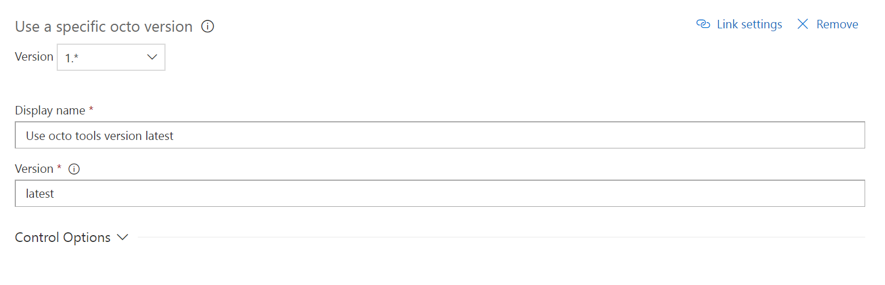
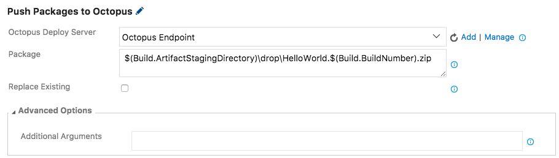
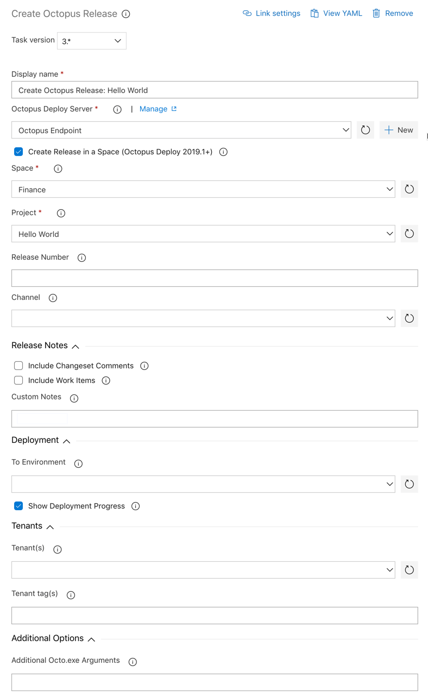
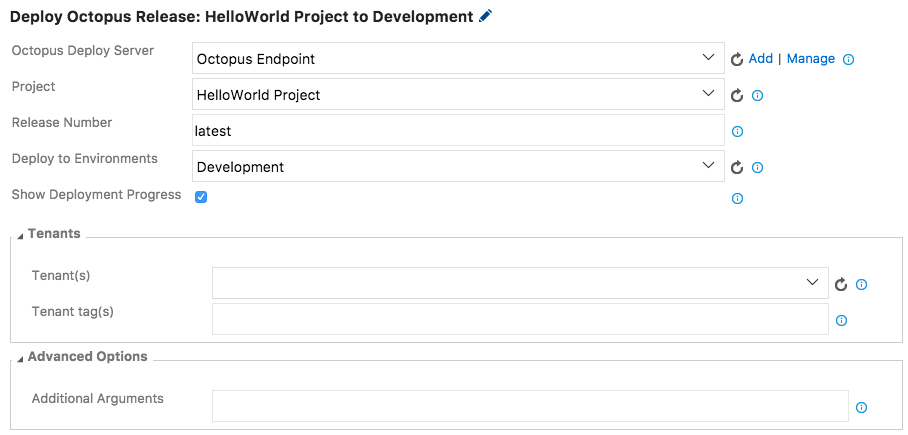
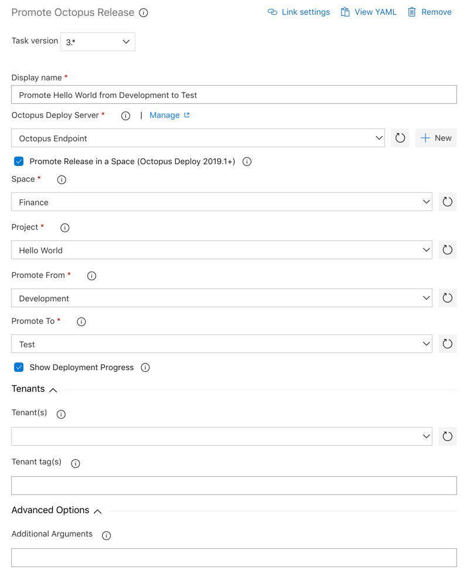

This extension provides Build and Release tasks to integrate with [Octopus Deploy](http://octopus.com), as well as a dashboard widget to show the status of a deployment in Octopus.

[Octopus Deploy](https://octopus.com) is great for deploying ASP.NET or .NET Core applications running on IIS or Azure, Windows services, SQL databases, and much, much more.

Note: This extension is only compatible with Visual Studio Team Services (VSTS) and Team Foundation Server (TFS) 2017 Update 1 and above. There is an alternative extension compatible with TFS 2015 Update 2 and above. See <a href="https://g.octopushq.com/TFS-VSTS-compat">the Octopus Documentation</a> for extension compatibility details and a download link for the alternative extension.

## Requirements
A minimum build agent version of `2.115.0` with dotnet core runtime 2.0 or later. When targeting build agents which do not have this capability, you can opt to use the dotnet installer task to satisfy this condition. An internet connection
is also required for tasks to download the Octopus tools when not available on a build agent.

### Azure DevOps (VSTS) Build Agents
Generally the Hosted Linux, Mac and Hosted VS2017 agent queues would satisfy the dotnet core requirements, however please refer to Microsoft documentation regarding what capabilities are provided by which hosted agent pools. The Octopus tasks
will automatically download, cache and use the latest version of the Octopus tools unless overridden by an installer task.

### TFS Build Agents / VSTS Custom agents
Unless your build agent has the portable version of the Octopus tools in the environment path the tasks will attempt to download and cache the Octopus tools. You can avoid subsequent downloads by using a known version in an installer task at the start of your build definition.

## Create an Octopus Deploy Connected Service
Before adding any Build or Release tasks to your process, configure an "Octopus Deploy" connected service in the administration section for your project.

You'll need an API Key for a user that has sufficient permissions for the tasks you want to perform in your build and release process.
For example, if your build needs to create a Release for Project A, the user who owns that API key will need ReleaseCreate role either unscoped or scoped to Project A.

## Tasks and Widgets

This extension adds the following tasks:

- Octopus tools installer
- Package Application
- Push Packages to Octopus
- Create Octopus Release
- Deploy Octopus Release
- Promote Octopus Release

And the following widget:

- Octopus Deploy Status

### Octopus tools installer

Options include:
* **Version**: The verion to use or 'latest' to always use the most recent version. Please note that this task is only required if you wish to change the version of octo to be used by subsequent tasks.

###  Package Application

*Note: You can still use [OctoPack](http://docs.octopusdeploy.com/display/OD/Using+OctoPack) as part of your MSBuild task to package and push Nuget packages to Octopus when targeting full .NET framework projects.*

 
 Options include:
 * **Package ID**: The ID of the package. e.g. MyCompany.App
 * **Package Format**: NuPkg or Zip
 * **Package Version**: The version of the package; must be a valid [SemVer](http://semver.org/) version; defaults to a timestamp-based version.
 * **Source Path**: The folder containing the files and folders to package. Defaults to working directory.
 * **Output Path**: The directory into which the generated package will be written. Defaults to working directory.
 * **NuGet Section**: This section lets you include additional details for the NuGet Package Metadata.
 * **Advanced Options Section**: Additional files to include in the package, and whether to overwrite any existing file of the same name.

###  Push Packages to Octopus

 
 Options include:
 * **Octopus Deploy Server**: Dropdown for selecting your Octopus Server (click Add or Manage to [create](#create-connected-service)).
 * **Push Package to Space**: Toggle to push your package to a [space](https://octopus.com/spaces). This is available in Octopus 2019.1 and newer.
 * **Space**: The name of the Octopus space to push a package to.
 * **Package**: Package file to push. To push multiple packages, enter on multiple lines.
 * **Replace Existing**: If the package already exists in the repository, the default behavior is to reject the new package being pushed. Set this flag to 'True' to overwrite the existing package.
 * **Additional Arguments**: Any additional [Octo.exe arguments](http://docs.octopusdeploy.com/display/OD/Pushing+packages) to include

###  Create Octopus Release

 

 Options include:
 * **Octopus Deploy Server**: Dropdown for selecting your Octopus Server (click Add or Manage to [create](#create-connected-service)).
 * **Create Release in a Space**: Toggle to create a release in a [space](https://octopus.com/spaces). This is available in Octopus Deploy 2019.1 and newer.
 * **Space Name**: The name of the Octopus space to create a release for.
 * **Project Name**: The name of the Octopus project to create a release for.
 * **Release Number**: Release number for the new release (leave blank to let Octopus decide).
 * **Channel**: Channel to use for the new release.
 * **Include Changeset comments**:  Whether to include changeset/commit comments in the Octopus release notes.
 * **Include Work Items**:  Whether to include linked work item titles in the Octopus release notes.
 * **Custom Notes**: Any additional static release notes to be included in the Octopus Release.
 * **To Environment**:  Optional environment to deploy to after Release creation.
 * **Show Deployment Progress**: Output from the deployment will appear in the log. If checked, the task will only succeed if the deployment is successful.
 * **Tenant(s)**: Comma-separated list of Tenants to deploy to. Note that if completed, this will be treated as a [Tenanted Deployment](http://docs.octopusdeploy.com/display/OD/Multi-tenant+deployments) by Octopus.
 * **Tenant tag(s)**: Comma-separated list of Tenant tags matching Tenants to deploy to. Note that if completed, this will be treated as a [Tenanted Deployment](http://docs.octopusdeploy.com/display/OD/Multi-tenant+deployments) by Octopus.
 * **Additional Octo.exe Arguments**:  Any additional [Octo.exe arguments](http://docs.octopusdeploy.com/display/OD/Creating+releases) to include

#### Regarding Release Notes:

The *Release Notes* options, if selected, will result in nicely formatted release notes with deep links to Team Foundation Server or Visual Studio Team Services. Even if no additional options are selected, the related VSTS Build number will be included in the Octopus release notes.

###  Deploy Octopus Release

 

 Options include:
 * **Octopus Deploy Server**: Dropdown for selecting your Octopus Server (click Add or Manage to [create](#create-connected-service)).
 * **Deploy Release in a Space**: Toggle to deploy a release in a [space](https://octopus.com/spaces). This is available in Octopus Deploy 2019.1 and newer.
 * **Space**: The name of the Octopus space.
 * **Project**: The name of the Octopus project.
 * **Release Number**: Release number for the new release (defaults to latest).
 * **Deploy to Environments**: Comma-separated list of Environments to deploy to.
 * **Show Deployment Progress**: Output from the deployment will appear in the log. If checked, the task will only succeed if the deployment is successful.
 * **Tenant(s)**: Comma-separated list of Tenants to deploy to. Note that if completed, this will be treated as a [Tenanted Deployment](http://docs.octopusdeploy.com/display/OD/Multi-tenant+deployments) by Octopus.
 * **Tenant tag(s)**: Comma-separated list of Tenant tags matching Tenants to deploy to. Note that if completed, this will be treated as a [Tenanted Deployment](http://docs.octopusdeploy.com/display/OD/Multi-tenant+deployments) by Octopus.
 * **Additional Arguments**:  Any additional [Octo.exe arguments](http://docs.octopusdeploy.com/display/OD/Creating+releases) to include

###  Promote Octopus Release

Options include:
 * **Octopus Deploy Server**: Dropdown for selecting your Octopus Server (click Manage to [create](#create-connected-service)).
 * **Promote Release in a Space**: Toggle to promote a release in a [space](https://octopus.com/spaces). This is available in Octopus Deploy 2019.1 and newer.
 * **Space**: The name of the Octopus space.
 * **Project**: The name of the Octopus project.
 * **Promote From**: Environment to promote a deployment from.
 * **Promote To**: Environment to promote a deployment to.
 * **Show Deployment Progress**: Output from the deployment will appear in the log. If checked, the task will only succeed if the deployment is successful.
 * **Tenant(s)**: Comma-separated list of Tenants to deploy to. Note that if completed, this will be treated as a [Tenanted Deployment](http://docs.octopusdeploy.com/display/OD/Multi-tenant+deployments) by Octopus.
 * **Tenant tag(s)**: Comma-separated list of Tenant tags matching Tenants to deploy to. Note that if completed, this will be treated as a [Tenanted Deployment](http://docs.octopusdeploy.com/display/OD/Multi-tenant+deployments) by Octopus.
 * **Additional Arguments**:  Any additional [Octo.exe arguments](http://docs.octopusdeploy.com/display/OD/Creating+releases) to include

###  Octopus Deploy Status Widget

Configuration settings:
 * **Size**: Either a 1x1 or a 2x1 widget size
 * **Octopus Connection**: Dropdown for selecting your Octopus Server
 * **Octopus Project**: Dropdown for selecting your Octopus Project
 * **Environment**: Dropdown for selecting your Octopus Environment. Note that you may select any environment, but the widget will only be populated if there is a deployment of that project to that environment.

 **Note:** Clicking on the widget will open the deployment log for the displayed task in Octopus.
